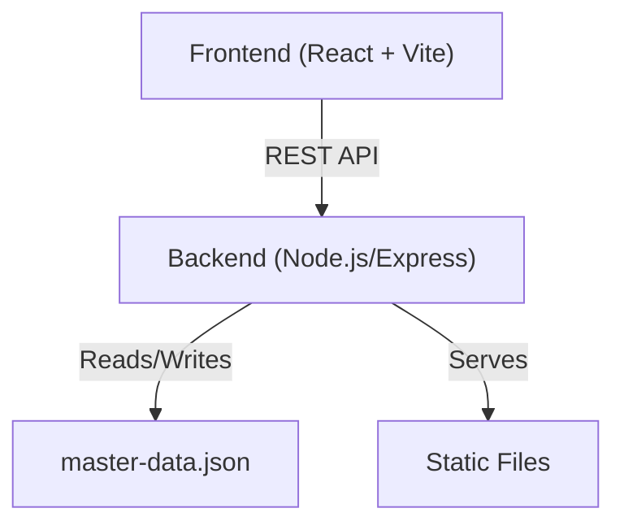
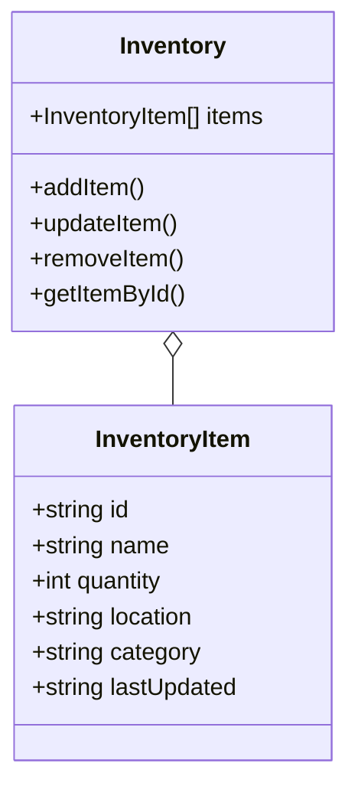
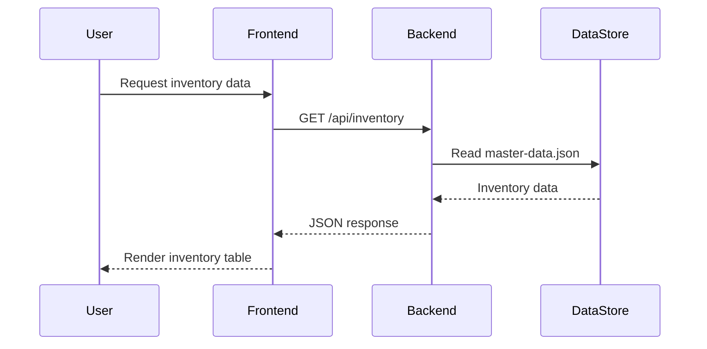
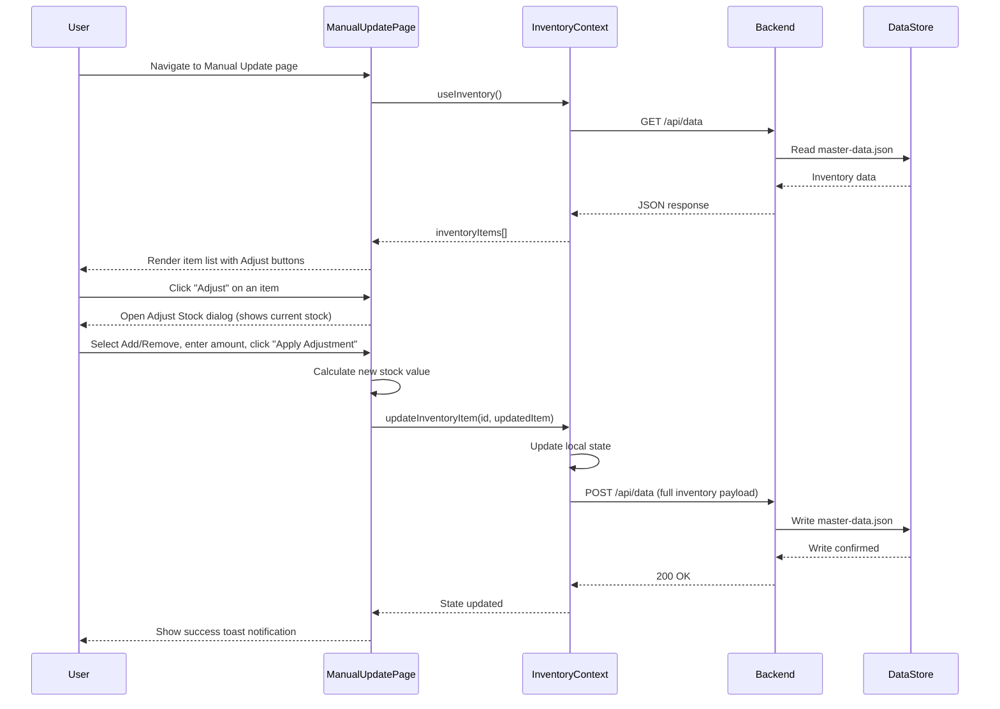
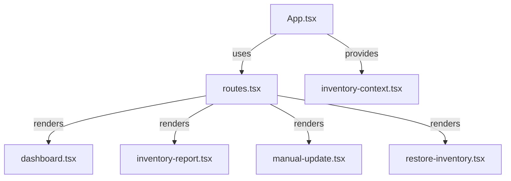

# Technical Choices, Models, and Implementation Details

This document provides an overview of the technical decisions, models, and implementation details for the Inventory Management Tool project. Each section includes a Mermaid diagram and a meaningful explanation.

---

## 1. High-Level Architecture

**Explanation:**
- The frontend is built with React and Vite, communicating with the backend via REST API calls.
- The backend is a Node.js/Express server that handles API requests, serves static files, and manages inventory data stored in `master-data.json`.

---

## 2. Inventory Data Model

**Explanation:**
- `InventoryItem` represents a single item in the inventory, with fields for identification, quantity, location, and metadata.
- `Inventory` manages a collection of `InventoryItem` objects and provides methods for CRUD operations.

---

## 3. API Endpoint Flow

**Explanation:**
- The user interacts with the frontend, which requests inventory data from the backend.
- The backend reads from `master-data.json` and returns the data as a JSON response, which the frontend then renders for the user.

---

## 4. Manual Stock Update Flow

**Explanation:**
- The user navigates to the Manual Update page, which loads the current inventory from the backend via the shared `InventoryContext`.
- Clicking "Adjust" on any item opens a dialog showing the current stock level, where the user selects Add or Remove and enters an amount.
- On confirmation, `handleAdjustStock` computes the new stock value and calls `updateInventoryItem` in `InventoryContext`.
- The context updates local state immediately, then persists the full inventory payload to the backend via `POST /api/data`, which writes the changes to `master-data.json`.
- A success toast is shown to the user once the update is complete.

---

## 4. Component Structure (Frontend)

**Explanation:**
- The main `App.tsx` component sets up routing and context providers.
- Different pages (dashboard, reports, updates) are rendered based on the route, all consuming the inventory context for state management.

---

## 5. Implementation Details

- **Frontend:**
  - Built with React, TypeScript, and Vite for fast development and hot module reloading.
  - Uses context for state management and modular UI components for reusability.
- **Backend:**
  - Node.js with Express for RESTful API endpoints.
  - Reads and writes inventory data to a JSON file for simplicity.
- **Styling:**
  - Tailwind CSS and custom styles for a modern, responsive UI.

---

*This document is intended to provide a clear, visual, and explanatory overview of the system's technical structure and design choices.*
